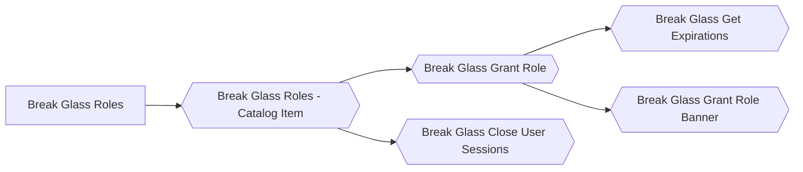

# Break Glass Role Management (-=DRAFT=-) (-=IN PROGRESS=-)

[[TOC]]

---
# About
\
**Break glass role management** (BGRM) is a role management framework where accounts are only provided role rights when needed. Unlike persistent roles where the rights granted remain available at all times, break glass roles are only granted for a limited time.  

This guide is to help ServiceNow admins setup BGRM for user roles insuring accounts are properly setup for privileged rights. The goal for BGRM is to work in conjunction with the default out-of-the-box (OOTB) ServiceNow role base security model to insure future upgradeability across ServiceNow releases. Therefore any role based security already setup in ServiceNow will not be impacted.

&nbsp;

---
## How BGRM works
\
BGRM uses the existing OOTB roles and access control lists used in ServiceNow. Refer to the ServiceNow documentation for information on [roles](https://docs.servicenow.com/csh?topicname=c_Roles&version=page) and [access control lists](https://docs.servicenow.com/en-US/bundle/tokyo-platform-administration/page/administer/contextual-security/concept/access-control-rules.html)). The only difference with BGRM is you do not grant an account the role directly like you do with ServiceNow, you utilize the BGRM framework to automatically grant and revoke the role from the account.

A break glass role record has the following components:
- _Name:_ The name of the break glass role. This can be the same or different from the ServiceNow role associated with the record.
- _Description:_ Helpful description of the break glass role.
- _Role:_ A reference to the *Role [sys_user_role]* table. This is the role that will be applied to the user's record temporarily.
- _User Criteria:_ A reference to the *User Criteria [user_criteria]* table. This determines if the user has access to the break glass role.
- _Lifespan:_ The number of minutes a user can have the break glass role.

After the standard ServiceNow roles and ACLs are created, a break glass role can be created pointing to the [sys_user_role] records. This creates a mapping between what roles a user can temporarily have and the users that can use them.

There is a catalog item called **Break Glass Roles** that will allow users to request access to the break glass roles listed in the *Break Glass Role [break_glass_role]* table. Each break glass role is associated with a user criteria, so only the break glass roles that user meets the user criteria with are displayed. This is the reduce overhead of authorization and approval manual steps. Once the request is made, automation provisions the break glass role for the user.

In the background, once an account's break glass role has expired, the break glass role (and the associated [sys_role]) will be automatically removed from the account and the account's sessions will be forcefully terminated.

!!! note MFA with BGRM
    ServiceNow offers multi-factor authentication (MFA) with one-time password (OTP) for role based accounts. The BGRM is built around just in time authorization for security, so it would make sense to consider leveraging MFA OTP on the roles created for BGRM. That way, when a break glass role is granted to an account and the account is forced to re-login, then the account will be presented with a MFA OTP prompt for additional security based on the newly assigned role. Refer to the ServiceNow documentation for setting up [Multi-factor authentication](https://docs.servicenow.com/csh?topicname=c_MultifactorAuthentication&version=page).

&nbsp;

---
### BGRM versus Elevated Roles
\
ServiceNow does not have a break glass framework or model for roles. While it is possible to designate a role as an elevated role, role elevation restriction only remains on the platform navigation of ServiceNow, not on the portals or applications. Also, role elevation lacks the temporal aspect of security privileges.

&nbsp;

---
## Follow along
\
ServiceNow offers many ways to solve a problem or configure an operational business model. These instructions are _*a*_ way and does not represent _*the*_ way on creating a break glass role framework. The best way to use these instructions is to read through them and see how the framework can be adopted and modified to fit your organization requirements. 

!!! note Update sets 
    There is an update set that implement this guide; _Break Glass Role Management_. The update set can be found at [https://github.com/ChristopherCarver/BreakGlassRoleMgt](https://github.com/ChristopherCarver/BreakGlassRoleMgt).   

!!! danger Modifying OOTB Tables
    This guide focuses on creating a robust framework tied closely to the out of the box (OOTB) tables already existing in ServiceNow. There are alternative implementation solutions within ServiceNow to accomplish the same result. Your mileage may vary depending on scope defined by and practices set by your organization and/or development team. This framework is meant to be as open and flexible to meet varying modifications to suit present and future requirements.

!!! note Cost Impact
    Custom tables are created in this framework and there could be a financial impact creating custom tables. ServiceNow allots a set amount of custom tables within an instance that a customer can create free of charge. After the set amount of custom tables are created, ServiceNow charges for custom tables. Talk with your ServiceNow Enterprise Account Executive to learn more.

!!! note Reduce Cost Impact
    To reduce any cost impact to your organization, you can extend OOTB tables free of charge. This guide leaves it to the implementation team to determine the best course of action.

&nbsp;

---
# BGRM Foundation
\
The foundation for the BGRM framework is based on the premise that the framework is separate from the default OOTB ServiceNow security model. The only overlap between the BGRM framework and standard ServiceNow user role model is the BGRM relies on ServiceNow to enforce role based security once an account has been granted a role by the BGRM framework. The BGRM framework takes care of the management of the roles independently. 

&nbsp;

---
## Break Glass Role Table
\
The *Break Glass Role [u_break_glass_role]* table contains all of the break glass roles available. This table will need to be manually populated by the admin. 

The *Break Glass Role [u_break_glass_role]* table will contain the following custom fields:

|Field|Description|
|-----|-----------|-
|Name|The name of the break glass role.|
|Description|A description of the break glass role.|
|Role|Reference to the ServiceNow table *Role [sys_user_role]*.|
|User Criteria|Reference to the ServiceNow table *User Criteria [user_criteria]*.|
|Lifespan|The number of minutes an account can be granted the role; default 4 hours.|

_Instructions:_

1. Navigate to **System Definition > Tables**.
1. Click **New**.
1. Under the **Table New record** section, fill in the following fields:
    - _Label:_ Break Glass Role 
    - _Name:_ u_break_glass_role
    - _Add module to menu:_ [User Administration]
1. In the record header, right-click and select **Save**.
1. In the **Columns** table, click **New**.
1. In the **Dictionary Entry New record** section, fill in the following fields:
    - _Type:_ [String]
    - _Column label:_ Name
    - _Column name:_ {*this should default to u_name*}
    - _Max length:_ 16
    - _Mandatory:_ [true]
1. Click **Submit**.
1. In the **Columns** table, click **New**.
1. In the **Dictionary Entry New record** section, fill in the following fields:
    - _Type:_ [String]
    - _Column label:_ Description
    - _Column name:_ {*this should default to u_description*}
    - _Max length:_ 64
1. Click **Submit**.
1. In the **Columns** table, click **New**.
1. In the **Dictionary Entry New record** section, fill in the following fields:
    - _Type:_ [Reference]
    - _Column label:_ Role
    - _Column name:_ {*this should default to u_role*}
    - _Mandatory:_ [true]
1. In the **Reference Specification** tab, fill in the following field:
    - _Reference:_ Role [sys_user_role]
1. Click **Submit**.
1. In the **Columns** table, click **New**.
1. In the **Dictionary Entry New record** section, fill in the following fields:
    - _Type:_ [Reference]
    - _Column label:_ User Criteria
    - _Column name:_ {*this should default to u_user_criteria*}
    - _Mandatory:_ [true]
1. In the **Reference Specification** tab, fill in the following field:
    - _Reference:_ User Criteria [user_criteria]
1. Click **Submit**.
1. In the **Columns** table, click **New**.
1. In the **Dictionary Entry New record** section, fill in the following fields:
    - _Type:_ [Integer]
    - _Column label:_ Lifespan
    - _Column name:_ {*this should default to u_lifespan*}
1. In the record header, right-click and select **Save**.
1. In the **Default Value** tab, fill in the following field:
    - _Default Value:_ 240
1. Click **Update**.
1. Click **Update**.

&nbsp;

---
## Break Glass Role Slush Bucket
\
The *Break Glass Role [u_break_glass_role]* table is referenced by the *Break Glass Roles* catalog item and the reference fields need to defined in a slush bucket for selection. 

1. In the browser URL type in **https://_{your instance}_/u_break_glass_role_list.do?sysparm_view=sys_ref_list**, where {your instance} is the name of your ServiceNow instance.
1. Right-click in the table column header and select **Configure > List Layout**. 
1. Under the **Selected** list, remove the **Sys ID** column; click **Sys ID** and then **<** to remove from the **Selected** list.
1. In under the **Available** list add the following columns to the **Selected** list by selecting the name of the column and click **>**.
    - Name
    - Description
1. Click **Save**.

&nbsp;

---
## Break Glass User Role Table
\
The *Break Glass User Role [u_break_glass_user_has_role]* table contains the relationship between the account and the break glass role. This table should be maintained by the catalog item *Break Glass Roles* and the supporting flow. 

The *Break Glass User Role [u_break_glass_user_has_role]* table will contain the following custom fields:
|Field|Description|
|-----|-----------|
|User|Reference to the ServiceNow OOTB table *User [sys_user]*.|
|Role|Reference to the custom table *Break Glass Role [u_break_glass_role]*.|
|Active|Designation that the account has been granted the role.|
|Expiration|When the role is set to expire on the account.|
|Expired|Calculated based on *Expiration*.|
|Request item|Reference to the ServiceNow table *Requested Item [sc_req_item]*.|

_Instructions:_

1. Navigate to **System Definition > Tables**.
1. Click **New**.
1. Under the **Table New record** section, fill in the following fields:
    - _Label:_ Break Glass User Role 
    - _Name:_ u_break_glass_user_role
    - _Add module to menu:_ [User Administration]
1. In the record header, right-click and select **Save**.
1. In the **Columns** table, click **New**.
1. In the **Dictionary Entry New record** section, fill in the following fields:
    - _Type:_ [Reference]
    - _Column label:_ User
    - _Column name:_ {*this should default to u_user*}
    - _Mandatory:_ [true]
1. In the **Reference Specification** tab, fill in the following field:
    - _Reference:_ User [sys_user]
1. Click **Submit**.
1. In the **Columns** table, click **New**.
1. In the **Dictionary Entry New record** section, fill in the following fields:
    - _Type:_ [Reference]
    - _Column label:_ Break Glass Role
    - _Column name:_ {*this should default to u_break_glass_role*}
    - _Mandatory:_ [true]
1. In the **Reference Specification** tab, fill in the following field:
    - _Reference:_ Role [u_break_glass_role]
1. Click **Submit**.
1. In the **Columns** table, click **New**.
1. In the **Dictionary Entry New record** section, fill in the following fields:
    - _Type:_ [True/False]
    - _Column label:_ Active
    - _Column name:_ {*this should default to u_active*}
1. In the **Default Value** tab, fill in the following field:
    - _Default Value:_ [true]
1. Click **Submit**.
1. In the **Columns** table, click **New**.
1. In the **Dictionary Entry New record** section, fill in the following fields:
    - _Type:_ [Date/Time]
    - _Column label:_ Expiration
    - _Column name:_ {*this should default to u_expiration*}
    - _Mandatory:_ [true]
1. Click **Submit**.
1. In the **Columns** table, click **New**.
1. In the **Dictionary Entry New record** section, fill in the following fields:
    - _Type:_ [True/False]
    - _Column label:_ Expired
    - _Column name:_ {*this should default to u_expired*}
1. Under **Related Links**, click **Advanced view**.
1. In the **Calculated Value** tab, fill in the following fields:
    - _Calculated:_ [true]
    - _Calculation Type:_ [Script]
    - _Calculation:_
        ```
        (function calculatedFieldValue(current) {

            // If there is no expiration set, return false.
            if (current.u_expiration.nil()) {
                current.setValue('u_expired',false);
                return false;
            }
        
            var dateToday = new GlideDateTime();
            // If the expiration is less than today's date and time, return false.
            if (current.u_expiration > dateToday) {
                current.setValue('u_expired',false);
                return false;
            }
        
            // Default to true
            current.setValue('u_expired',true);
            return true; // return the calculated value
        
        })(current);
        ```
1. Click **Submit**.
1. In the **Columns** table, click **New**.
1. In the **Dictionary Entry New record** section, fill in the following fields:
    - _Type:_ [Reference]
    - _Column label:_ Request item
    - _Column name:_ {*this should default to u_request_item*}
    - _Mandatory:_ [true]
1. In the **Reference Specification** tab, fill in the following field:
    - _Reference:_ Requested Item [sc_req_item].
1. Click **Submit**.
1. Click **Update**.

&nbsp;

---
## Break Glass Util
\
The _BreakGlassUtil_ script include supports various break glass operations used in break glass catalog items and flows.

_Instructions:_

1. Navigate to **System Definition > Script Includes**.
1. Click **New**.
1. In the **Script Include New record** section, fill in the following fields:
    - _Name:_ BreakGlassUtil
    - _API Name:_ {*this should default to global.BreakGlassUtil*}
    - _Client callable:_ [false]
    - _Description:_ Utility operations in the support for break glass roles. See [u_break_glass_role] and [u_break_glass_user_has_role] tables. 
    - _Script:_
        ```
        var BreakGlassUtil = Class.create();
        BreakGlassUtil.prototype = {
            initialize: function() {},

            // returns a comma delimited string of break glass roles the user has access to
            getRoles: function() {
                var breakGlassRoleList = [];

                // get all the break glass roles
                var breakGlassRole = new GlideRecord('u_break_glass_role');
                breakGlassRole.query();
                while (breakGlassRole.next()) {
                    var criteria = [];
                    criteria.push(breakGlassRole.getValue('u_user_criteria'));
                    // if the user matches the user criteria for the role
                    if (sn_uc.UserCriteriaLoader.userMatches(gs.getUserID(), criteria)) {
                        // then store it in the array
                        breakGlassRoleList.push(breakGlassRole.getValue('sys_id'));
                    }
                }

                // return the list of break glass roles the user has access to as a comma delimited         string
                return breakGlassRoleList.join(',');
            },
            type: 'BreakGlassUtil'
        };
        ```
1. Click **Submit**.

&nbsp;

---
## Break Glass Roles
\
The _Break Glass Roles_ catalog item is a self-service account elevation role provisioning service.

_Instructions:_

1. Navigate to **Service Catalog > Catalog Definitions > Maintain Items**.
1. Click **New**.
1. In the **Catalog item New record** section, fill in the following fields:
    - _Name:_ Break Glass Roles
    - _Catalogs:_ [Service Catalog] {*choose the right catalog for you*}
    - _Category:_ [Role Delegation] {*choose the right category for you*}
    - _Fulfillment automation level:_ [Fully automated]
1. In the record header, right-click and select **Save**.
1. In the **Item Details** tab, fill in the following fields:
    - _Short Description:_ Temporary account role elevation.
    - _Description:_

        **About:**
        The *Break Glass Roles* catalog item temporary grants your account an elevated break glass roles. A break glass role is a temporary privileged role that an account checks out to perform elevated operations.

        **Usage:**
        Only the break glass roles that are available to your account will appear in the *Role* field. 

        **Important:**
        - This is a fully automated request. After your submit your request, your ServiceNow session will be forcible terminated by ServiceNow and you will have to log back into ServiceNow. Upon logging into ServiceNow your account will have the requested role temporarily.
        - Once your temporary break glass role expires, the role will automatically be removed from your account and your ServiceNow session will be forcible terminated by ServiceNow.
        - If your ServiceNow session is not terminated, then check your request to determine the reason why your request was not granted. 

1. In the record header, right-click and select **Save**.
1. In the **Variables** tab, click **New**.
1. In the **Variable New record** section, fill in the following fields:
    - _Type:_ [List Collector]
    - _Mandatory:_ [true]
    - _Order:_ 100
1. In the **Question** tab, fill in the following fields:
    - _Question:_ Roles
    - _Name:_ {*should default to roles*}
1. In the **Type Specifications** tab, fill in the following fields:
    - _List table:_ Break Glass Role [u_break_glass_role]
    - _Reference qualifier:_
        ```
        javascript: var query;
        query = "sys_idIN" + new BreakGlassUtil().getRoles();
        query;
        ```
    - _Variable attributes:_ 
        ```
        no_filter,ref_auto_completer=AJAXTableCompleter,ref_ac_columns=u_name;u_description,ref_ac_order_by=u_name
        ```
1. Click **Update**.
1. In the **Variables** tab, click **New**.
1. In the **Variable New record** section, fill in the following fields:
    - _Type:_ [Single Line Text]
    - _Mandatory:_ [true]
    - _Order:_ 200
1. In the **Question** tab, fill in the following fields:
    - _Question:_ Justification
    - _Name:_ {*should default to justification*}
1. Click **Submit**.
1. Click **Update**.

&nbsp;

---
# Break Glass Role Process Engine
\
The _Break Glass Roles_ catalog item will have a custom process engine to process the request. 

_Diagram:_

Here is the calling hierarchy outline of the custom operations starting from the catalog item *Break Glass Roles* calling the flow, subflows, and actions.



To prevent having to go back and forth when creating parent and child components in the documentation, this guide will build out the process engine flow backwards in this order:
1. Break Glass Get Expirations
1. Break Glass Grant Role Banner
1. Break Glass Grant Role
1. Break Glass Close User Sessions
1. Break Glass Roles - Catalog Item

This will allow the parent to link to the existing child operation component, without having to go back and update parent calling operations.

&nbsp;

---
## Break Glass Get Expirations
\
The *Break Glass Get Expirations* is an action component within the flow operations. The purpose of the action is to determine when the break glass role is expiring and expires. Both of these dates and times are used for banners and used to determine when to revoke the break glass role from the user's account. 

_Instructions:_

1. Navigate to **Process Automation > Flow Designer**. A new tab will open for _Flow Designer_.
1. In **Flow Designer** click **New** and select **Action**.
1. Fill in the following fields:
    -_Action name:_ Break Glass Get Expirations
    -_Description:_ Calculate the break glass role expiring and expires date and time based on the current time and the lifespan of the role.
1. Click **Submit**.
1. Under **Action Outline**, click **Inputs**.
1. In the **Action Inputs** section, click **Create Input** and fill in the following fields:
    - _Label:_ Break Glass Role
    - _Name:_ break_glass_role
    - _Type:_ (**Reference > Break Glass Role**)
    - _Mandatory:_ [true]
1. Under **Action Outline**, between **Inputs** and **Error Evaluation**, click the **+** sign.
1. In the **Choose a step to add to your action**, find and select **Script**.
1. Under **Script Step**, under **Input Variables**, click **Create Variable**, and fill in the following fields:
    - _Name:_ lifespan
    - _Value:_ (**Inputs > Break Glass Role > Lifespan**)
1. Under **Script** add the following:
    ```
    (function execute(inputs, outputs) {
      var lifespan = inputs.lifespan;
      
      // calc. expiring 
      var lifespanExpiring = parseInt(lifespan * 0.9, 10); // 90% of the lifespan in minutes
      var nowExpiring = new GlideDateTime();
      nowExpiring.addSeconds(lifespanExpiring * 60);
      outputs.expiring_system = nowExpiring.getValue();
      outputs.expiring_local = nowExpiring.getDisplayValue();
    	
      // calc. expires
      var nowExpires = new GlideDateTime();
      nowExpires.addSeconds(lifespan * 60);
      outputs.expires_system = nowExpires.getValue();
      outputs.expires_local = nowExpires.getDisplayValue();
    
    })(inputs, outputs);
    ```
1. Under **Output Variables**, click **Create Variable** and fill in the following fields:
    - _Label:_ Expiring System
    - _Name:_ expiring_system
    - _Type:_ [Date/Time]
    - _Mandatory:_ [true]
    1. Under **Output Variables**, click **Create Variable** and fill in the following fields:
    - _Label:_ Expiring System
    - _Name:_ expiring_local
    - _Type:_ [Date/Time]
    - _Mandatory:_ [true]
1. Under **Output Variables**, click **Create Variable** and fill in the following fields:
    - _Label:_ Expires System
    - _Name:_ expires_system
    - _Type:_ [Date/Time]
    - _Mandatory:_ [true]
1. Under **Output Variables**, click **Create Variable** and fill in the following fields:
    - _Label:_ Expires Local
    - _Name:_ expires_local
    - _Type:_ [Date/Time]
    - _Mandatory:_ [true]
1. Under **Action Outline**, click **Outputs**.
1. Under **Action Output**, click **Edit Outputs**.
1. Click **Create Output** and fill in the following fields:
    - _Label:_ Expiring System
    - _Name:_ expiring_system
    - _Type:_ [Date/Time]
    - _Mandatory:_ [true]
1. Click **Create Output** and fill in the following fields:
    - _Label:_ Expiring Local
    - _Name:_ expiring_local
    - _Type:_ [Date/Time]
    - _Mandatory:_ [true]
1. Click **Create Output** and fill in the following fields:
    - _Label:_ Expires System
    - _Name:_ expires_system
    - _Type:_ [Date/Time]
    - _Mandatory:_ [true]
1. Click **Create Output** and fill in the following fields:
    - _Label:_ Expires Local
    - _Name:_ expires_local
    - _Type:_ [Date/Time]
    - _Mandatory:_ [true]
1. Click **Exit Edit Mode**.
1. Under **Action Output**, fill in the following fields:
    - _Expiring System:_ **Script Step > Expiring System**
    - _Expiring Local:_ **Script Step > Expiring Local**
    - _Expires System:_ **Script Step > Expires System**
    - _Expires Local:_ **Script Step > Expires Local**
1. Click **Save**.
1. Click **Publish**.

&nbsp;

---
## Break Glass Grant Role Banner
\
The _Break Glass Grant Role Banner_ is a subflow component within the flow operations. The purpose of the subflow is to setup notification banners for the user to show that they were granted the break glass role, when the break glass role is expiring and when the break glass role has expired. 

The subflow uses the ServiceNow OOTB banner feature. ServiceNow banners lack the ability to target individual accounts. To target banners for specific users, users will need unique roles applied to their accounts. This means each user account will need a unique role. This flow checks for the role *u_user_[user id]* to exist. Custom roles are discussed further down.

Because custom individual roles per user are not standard practice, the subflow checks the system property *break_glass.banner* to see if the value is true or false. If true, then banners are used; else banners are not used.

_Instructions:_

1. Navigate to **Process Automation > Flow Designer**. A new tab will open for _Flow Designer_.
1. In **Flow Designer** click **New** and select **Subflow**.
1. Under **Subflow properties**, fill in the following fields:
    - _Name:_ Break Glass Grant Role Banner
    - _Description:_ Applies a new banner for the break glass role that was granted.
    - _Run As:_ [System User]
1. Click **Submit**.
1. Click **More Actions menu** (the ... on top right) and select **Flow Variables**.
1. Click **Add new input** (the + ) and fill in the following fields:
    - _Label:_ Banner Label 
    - _Name:_ banner_label
    - _Type:_ [String]
1. Click **Add new input** (the + ) and fill in the following fields:
    - _Label:_ User Role Name
    - _Name:_ user_role_name
    - _Type:_ [String]
1. Close the **Flow Variables** window. 
1. Click **Subflow Inputs & Outputs**.
1. Under **Inputs**, click the **+** sign and fill in the following fields:
    - _Label:_ Request Item
    - _Name:_ request_item
    - _Type:_ (**Reference > Requested Item**)
    - _Mandatory:_ [true]
1. Under **Inputs**, click the **+** sign and fill in the following fields:
    - _Label:_ Break Glass Role
    - _Name:_ break_glass_role
    - _Type:_ (**Reference > Break Glass Role**)
    - _Mandatory:_ [true]
1. Under **Inputs**, click the **+** sign and fill in the following fields:
    - _Label:_ Expiring Local
    - _Name:_ expiring_local
    - _Type:_ [Date/Time]
    - _Mandatory:_ [true]
1. Under **Inputs**, click the **+** sign and fill in the following fields:
    - _Label:_ Expires Local
    - _Name:_ expires_local
    - _Type:_ [Date/Time]
    - _Mandatory:_ [true]
1. Under **Inputs**, click the **+** sign and fill in the following fields:
    - _Label:_ Expires
    - _Name:_ expires
    - _Type:_ [Date/Time]
    - _Mandatory:_ [true]
1. Click **Done**.
1. The following instructions are adding operations under the **Actions** section. Due to the difficulty of documenting flow operations, the following sub-ordered steps represent the order of flow operations. At the start of each action there will either be the choice **Add an Action, Flow Logic, or Subflow** or a grouping of **Action**, **Flow Logic**, and **Subflow**. The step will assume general knowledge of which to select and finalizing the operation by clicking **Done**. 
    1. **Flow Logic > Set Flow Variables** (click the **+** sign to add a new variable):
        - _Name:_ User Role Name
        - _Data:_ u_user_(**Input > Request Item > Requested for > User ID**)
        - _Name:_ Banner Label
        - _Data:_ break_glass_role.(**Input > Break Glass Role > Name**.**Input > Request Item > Requested for > User ID**)
    1. **Action > ServiceNow Core > Look Up Records**
        - _Table:_ Banner Announcements [sys_ux_banner_announcement]
        - _Conditions:_ [**Label**] [is] (**Flow Variables > Banner Label**)
    1. **Flow Logic > For Each**
        - _Items:_ (**2 - Lookup Records > Banner Announcement Records**)
    1. (Under *3 - For Each*) **Action > ServiceNow Core > Delete Record**
        - _Record:_ (**3 - For Each > Banner Announcement Record**)
    1. **Action > ServiceNow Core > Look Up Record**
        - _Table:_ System Property [sys_properties]
        - _Conditions:_ [Name] [is] break_glass.banner
    1. **Flow Logic > If**
        - _Condition Label:_ break_glass.banner is false
        - _Condition 1:_ (**5 - Look Up Record > System Property Record > Value**) [is] [false]
    1. (Under *6 - If*) **Flow Logic > End Flow**
    1. **Action > ServiceNow Core > Look Up Record**
        - _Table:_ Role [sys_user_role]
        - _Conditions:_ [Name] [starts with] (**Flow Variables > User Role Name**)
    1. **Flow Logic > If**
        - _Condition Label:_ user does not have a private role
        - _Condition 1:_ (**8 - Look Up Record > Status**) [is] [Error]
    1. (Under *9 - If*) **Flow Logic > End Flow**
    1. **Action > ServiceNow Core > Create Record**
        - _Table:_ Banner Announcement [sys_ux_banner_announcement]
        - _Fields:_
            - [Label] (**Flow Variables > Banner Label**)
            - [Heading] Break Glass Role Granted
            - [Summary] 
                ```
                var expires = new GlideDateTime(fd_data.subflow_inputs.expires);
                var expiresTZ = fd_data.subflow_inputs.request_item.requested_for.time_zone;
                var tz = Packages.java.util.TimeZone.getTimeZone(expiresTZ);
                expires.setTZ(tz);
                return "Break glass role '" + fd_data.subflow_inputs.break_glass_role.u_name + "' is set to expire on " + expires.getDisplayValue().toString() + ".";
                ```
            - [Color] [Positive]
            - [Show for] [Users with specific roles/groups]
            - [Roles] (**8 - Look Up Record > Role Record > Name**)
            - [Start] 
                ```
                var now = new GlideDateTime();
                return now.getDisplayValue();
                ```
            - [End] **Input > Expiring**
    1. **Action > ServiceNow Core > Create Record**
        - _Table:_ Banner Announcement Mapping [sys_ux_m2m_banner_announcement]
        - _Fields:_
            - [Announcement Config] [Unified Navigation]
            - [Announcement] (**11 - Create Record > Banner Announcement Record**)
    1. **Action > ServiceNow Core > Create Record**
        - _Table:_ Banner Announcement [sys_ux_banner_announcement]
        - _Fields:_
            - [Label] (**Flow Variables > Banner Label**)
            - [Heading] Break Glass Role Expiring
            - [Summary]
                ```
                var expires = new GlideDateTime(fd_data.subflow_inputs.expires);
                var expiresTZ = fd_data.subflow_inputs.request_item.requested_for.time_zone;
                var tz = Packages.java.util.TimeZone.getTimeZone(expiresTZ);
                expires.setTZ(tz);
                return "Break glass role '" + fd_data.subflow_inputs.break_glass_role.u_name + "' is set to expire on " + expires.getDisplayValue().toString() + ".";
                ```
            - [Color] [Warning]
            - [Show for] [Users with specific roles/groups]
            - [Roles] (**8 - Look Up Record > Role Record > Name**)
            - [Start] **Input > Expiring Local**
            - [End] (**Input > Expires Local**)
    1. **Action > ServiceNow Core > Create Record**
        - _Table:_ Banner Announcement Mapping [sys_ux_m2m_banner_announcement]
        - _Fields:_
            - [Announcement Config] [Unified Navigation]
            - [Announcement] (**13 - Create Record > Banner Announcement Record**)
    1. **Action > ServiceNow Core > Create Record**
        - _Table:_ Banner Announcement [sys_ux_banner_announcement]
        - _Fields:_
            - [Label] (**Flow Variables > Banner Label**)
            - [Heading] Break Glass Role Expired
            - [Summary] Break glass role '(**Input > Break Glass Role > Name**)' has expired. Break glass role revocation and user session termination imminent.
            - [Color] [Critical]
            - [Show for] [Users with specific roles/groups]
            - [Roles] (**8 - Look Up Record > Role Record > Name**)
            - [Start] (**Input > Expires Local**)
    1. **Action > ServiceNow Core > Create Record**
        - _Table:_ Banner Announcement Mapping [sys_ux_m2m_banner_announcement]
        - _Fields:_
            - [Announcement Config] [Unified Navigation]
            - [Announcement] (**15 - Create Record > Banner Announcement Record**)
1. Click **Save**.
1. Click **Publish**.

The above subflow relies on two additional aspects; a system property and that users have a unique user account role. If you do not plan on using banners with your break glass deployment, then set the value of **break_glass.banner** to **false** in the *System Properties [sys_properties]* table.

_Instructions:_

1. In the **Filter** in the Filter Navigator, enter **sys_properties.list**.
1. Click **New** and fill in the following fields:
    - _Name:_ **break_glass.banner**
    - _Description:_
        ```
        Enables banner notifications for break glass operations. 

        Before enabling this, all accounts must have their own private role called u_user_[user_id] assigned to them, this is because banners only work with groups and roles. If you wish to bulk create and assign private roles to all user accounts, apply the Break Glass Banner Supplemental update set. This will create a Fix Script called Break Glass Create Private User Roles and two business rules that automatically manages private roles for user accounts. 
        ```
    - _Type:_ [True/False]
    - _Value:_ false
1. Click **Submit**.

!!! note Banner Activation
    The steps above default banner activation to false. If you wish to use banner announcements for break glass roles, then set the value to **true**.

!!! warning Unique User Roles
    The following instructions will create unique user roles on your ServiceNow instance. If you _**do not**_ intend to use banner announcements for break glass management, then skip to the **Break Glass Grant Role** section below.

The following fix script creates unique roles for each of your existing users on your instance. This is to be used in conjunction with the following business rules as well. The fix script is meant as a one time use script to be executed and then have the business rules maintain the creation and deletion of unique roles for user records going forward.

_Instructions:_

1. Navigate to **System Definition > Fix Scripts**.
1. Click **New** and fill in the following fields:
    - _Name:_ Break Glass Create Private User Roles
    - _Description:_ 
        ```
        The following script creates unique user roles per user account. This is to allow targeted banner announcements for specific users. The fix script takes existing user accounts and creates a unique role for the account.

        The fix script is to be used in conjunction with the business rules Grant Unique User Role and Revoke Unique User Role. 

        ```
    - _Script:_
        ```
        // note - the code was intentionally commented out to 
        //        insure you review and confirm its validity 
        //        in your environment. This is creating 
        //        unique roles for every account on your 
        //        instance.

        // gather all the user accounts, filtering only those with a user id.
        var users = new GlideRecord('sys_user');
        users.addEncodedQuery('user_nameISNOTEMPTY');
        users.query();
        gs.info('Count: ' + users.getRowCount());

        /* CODE REVIEW THE FOLLOWING
        // go through all the users
        while(users.next()) {
        	gs.info('User: ' + users.getValue('user_name'));
        	var roleName = 'u_user_' + users.getValue('user_name');
        	gs.info('\tRole Name: ' + roleName);
        	// see if the role already exists
        	var roles = new GlideRecord('sys_user_role');
        	roles.addQuery('name',roleName);
        	roles.query();
        	// if the role does not exist, then create the role
        	if(!roles.next()) {
        		var role = new GlideRecord('sys_user_role');
        		role.initialize();
        		role.setValue('name',roleName);
        		role.insert();
        		gs.info('\tRole created.');
        	} else {
        		gs.info('\tRole exists.');
        	}
        	// get the role that already existed or was just created
        	var uniqueRole = new GlideRecord('sys_user_role');
        	uniqueRole.addQuery('name',roleName);
        	uniqueRole.query();
        	uniqueRole.next();
        	if(uniqueRole.getRowCount() > 0) {
        		gs.info('\tRole retrieved.');
        	} else {
        		gs.info('\tWARNING - Role not found.');
        	}
        	// see if the user has the role already
        	var hasRoles = new GlideRecord('sys_user_has_role');
        	hasRoles.addQuery('user',users.getValue('sys_id'));
        	hasRoles.addQuery('role',uniqueRole.getValue('sys_id'));
        	hasRoles.query();
        	// if the user does not have the role, then grant the role to the user
        	if(!hasRoles.next()) {
        		var hasRole = new GlideRecord('sys_user_has_role');
        		hasRole.initialize();
        		hasRole.setValue('user',users.getValue('sys_id'));
        		hasRole.setValue('role',uniqueRole.getValue('sys_id'));
        		hasRole.setValue('state','active');
        		hasRole.insert();
        		gs.info('\tRole granted.');
        	} else {
        		gs.info('\tRole provided. ' + hasRole.getValue('sys_id'));
        	}

        }
        */
        ```
1. In the record header, right-click and select **Save**.

A large section of the code is commented out. This is intentional and meant for you to code review. You are adding unique roles to your instance of ServiceNow. It is important that you make sure that the right accounts will be set up. Once code review is complete, uncomment the code, save the fix script and run the fix script.

The following business rule will create a unique role for new user records.

_Instructions:_

1. Navigate to **System Definition > Business Rules**.
1. Click **New** and fill in the following fields:
    - _Name:_ Create Unique User Role For New Users
    - _Table:_ User [sys_user]
    - _Advanced:_ [true]
1. Under **When to run**, fill in the following fields:
    - _When:_ [after]
    - _Insert:_ [true]
1. Under **Advanced**, fill in the following field:
    - _Script:_
        ```
        (function executeRule(current, previous /*null when async*/ ) {
            var roleName = 'u_user_' + current.getValue('user_name');
            // see if the role already exists
            var roles = new GlideRecord('sys_user_role');
            roles.addQuery('name', roleName);
            roles.query();
            // if the role does not exist, then create the role
            if (!roles.next()) {
                var role = new GlideRecord('sys_user_role');
                role.initialize();
                role.setValue('name', roleName);
                role.insert();
            }
            // get the role that already existed or was just created
            var uniqueRole = new GlideRecord('sys_user_role');
            uniqueRole.addQuery('name', roleName);
            uniqueRole.query();
            uniqueRole.next();
            // see if the user has the role already
            var hasRoles = new GlideRecord('sys_user_has_role');
            hasRoles.addQuery('user', current.getValue('sys_id'));
            hasRoles.addQuery('role', uniqueRole.getValue('sys_id'));
            hasRoles.query();
            // if the user does not have the role, then grant the role to the user
            if (!hasRoles.next()) {
                var hasRole = new GlideRecord('sys_user_has_role');
                hasRole.initialize();
                hasRole.setValue('user', current.getValue('sys_id'));
                hasRole.setValue('role', uniqueRole.getValue('sys_id'));
                hasRole.setValue('state', 'active');
                hasRole.insert();
            }
        })(current, previous);
        ```
1. Click **Submit**.

The following business rule will delete the unique role when user records are deleted.

_Instructions:_

1. Navigate to **System Definition > Business Rules**.
1. Click **New** and fill in the following fields:
    - _Name:_ Delete Unique User Role For Deleted User
    - _Table:_ User [sys_user]
    - _Advanced:_ [true]
1. Under **When to run**, fill in the following fields:
    - _When:_ [before]
    - _Delete:_ [true]
1. Under **Advanced**, fill in the following field:
    - _Script:_
        ```
        (function executeRule(current, previous /*null when async*/ ) {
            var roleName = 'u_user_' + current.getValue('user_name');

        	// see if the role exists
            var role = new GlideRecord('sys_user_role');
            role.addQuery('name', roleName);
            role.query();
            // if the role does not exist, then exit
            if (!role.next()) {
                return;
            }

        	// remove the role from the user
            var hasRole = new GlideRecord('sys_user_has_role');
            hasRole.addQuery('user', current.getValue('sys_id'));
            hasRole.addQuery('role', role.getValue('sys_id'));
            hasRole.query();
            // if the user does not have the role, then grant the role to the user
            if (hasRole.next()) {
                hasRole.deleteRecord();
            }

        	// remove the role
        	role.deleteRecord();

        })(current, previous);
        ```
1. Click **Submit**.

&nbsp;

---
## Break Glass Grant Role
\
The *Break Glass Grant Role* is a subflow component within the flow operations. The purpose of the subflow is to grant the user a specific break glass role and setup a banner announcement if enabled to do so.

_Instructions:_

1. Navigate to **Process Automation > Flow Designer**. A new tab will open for _Flow Designer_.
1. In **Flow Designer** click **New** and select **Subflow**.
1. Under **Subflow properties**, fill in the following fields:
    - _Name:_ Break Glass Grant Role
    - _Description:_ Grants the break glass role to the user.
    - _Run As:_ [System User]
1. Click **Submit**.
1. Click **Subflow Inputs & Outputs**.
1. Under **Inputs**, click the **+** sign and fill in the following fields:
    - _Label:_ Request Item
    - _Name:_ request_item
    - _Type:_ **Reference > Requested Item**
    - _Mandatory:_ [true]
1. Under **Inputs**, click the **+** sign and fill in the following fields:
    - _Label:_ Break Glass Role
    - _Name:_ break_glass_role
    - _Type:_ **Reference > Break Glass Role**
    - _Mandatory:_ [true]
1. Under **Outputs**, click the **+** sign and fill in the following fields:
    - _Label:_ Granted
    - _Name:_ granted
    - _Type:_ [True/False]
1. Under **Outputs**, click the **+** sign and fill in the following fields:
    - _Label:_ Message
    - _Name:_ message
    - _Type:_ [String]
1. Click **Done**.
1. The following instructions are adding operations under the **Actions** section. Due to the difficulty of documenting flow operations, the following sub-ordered steps represent the order of flow operations. At the start of each action there will either be the choice **Add an Action, Flow Logic, or Subflow** or a grouping of **Action**, **Flow Logic**, and **Subflow**. The step will assume general knowledge of which to select and finalizing the operation by clicking **Done**. 
    1. **Action > ServiceNow Core > Look Up Records**
        - _Table:_ Break Glass User Role [u_break_glass_user_has_role]
        - _Conditions:_
            - [Active] [is] [true] AND
            - [Break Glass Role] [is] (**Input > Break Glass Role**) AND 
            - [User] [is] (**Input > Request Item > Requested for**)
    1. **Flow Logic > For Each**
        - _Items:_ (**1 - Look Up Recods > Break Glass User Role Records**)
    1. (Under 2 - For Each) **Action > ServiceNow Core > Update Record**
        - _Record:_ (**2 - For Each > Break Glass User Role Record**)
        - _Table:_ Break Glass User Role [u_break_glass_user_has_role]
        - _Fields:_ 
            - [Active] [false]
    1. **Action > ServiceNow Core > Look Up Records**
        - _Table:_ User Role [sys_user_has_role]
        - _Conditions:_
            - [User] [is] (**Input > Request Item > Requested for**) AND
            - [Role] [is] (**Input > Break Glass Role > Role**)
    1. **Flow Logic > If**
        - _Condition Label:_ the user does not have the system role
        - _Condition 1:_ (**4 - Look Up Records > Count**) [is] 0
    1. (Under 5 - If) **Action > ServiceNow Core > Create Record**
        - _Table:_ User Role [sys_user_has_role]
        - _Fields:_
            - [User] (**Input > Request Item > Requested for**)
            - [Role] (**Input > Break Glass Role > Role**)
    1. **Action > Global > Break Glass Get Expirations**
        - _Break Glass Role:_ **Input > Break Glass Role**
    1. **Action > ServiceNow Core > Create Record**
        - _Table:_ Break Glass User Role [u_break_glass_user_has_role]
        - _Fields:_
            - [User] (**Input > Request Item > Requested for**)
            - [Break Glass Role] (**Input > Break Glass Role**)
            - [Active] [true]
            - [Expiration] (**7 - Break Glass Get Expirations > Expires Local**)
            - [Request Item] (**Input > Request Item**)
    1. **Subflow > Break Glass Grant Role Banner**
        - _Expiring Local:_ (**7 - Break Glass Get Expirations > Expiring Local**)
        - _Expires Local:_ (**7 - Break Glass Get Expirations > Expires Local**)
        - _Request Item:_ (**Input > Request Item**)
        - _Break Glass Role:_ (**Input > Break Glass Role**)
        - _Expires:_ (**7 - Break Glass Get Expirations > Expires System**)
    1. **Flow Logic > Assign Subflow Outputs**
        - [Granted] [true]
        - [Message] Granted the break glass role (**Input > Break Glass Role > Name**) to (**Input > Request Item > Requested for > Name**).
    1. (Under ERROR HANDLER) **Flow Logic > Assign Subflow Outputs**
        - [Granted] [false]
        - [Message] An unexpected error occurred granting the break glass role (**Input > Break Glass Role > Name**) to (**Input > Request Item > Requested for > Name**).
1. Click **Save**.
1. Click **Publish**.

&nbsp;

---
## Break Glass Close User Sessions
\
The *Break Glass Close User Sessions* is an action component within the flow operations. The purpose of the action is to terminate all of the user's active sessions. This will force the user to re-login into ServiceNow and the user's account rolled privileges reset. This is also used later on, when automation revokes the break glass role from the user as well.

_Instructions:_

1. Navigate to **Process Automation > Flow Designer**. A new tab will open for _Flow Designer_.
1. In **Flow Designer** click **New** and select **Action**.
1. Fill in the following fields:
    -_Action name:_ Break Glass Close User Sessions
    -_Description:_ Terminate the user's active ServiceNow sessions forcing the user to have to re-login into ServiceNow.
1. Click **Submit**.
1. Under **Action Outline**, click **Inputs**.
1. In the **Action Inputs** section, click **Create Input** and fill in the following fields:
    - _Label:_ User
    - _Name:_ user
    - _Type:_ **Reference > User [sys_user]**
    - _Mandatory:_ [true]
1. Under **Action Outline**, between **Inputs** and **Error Evaluation**, click the **+** sign.
1. In the **Choose a step to add to your action**, find and select **Script**.
1. Under **Script Step**, under **Input Variables**, click **Create Variable**, and fill in the following fields:
    - _Name:_ user_id
    - _Value:_ (**Inputs > User > User ID**)
1. Under **Script** add the following:
    ```
    (function execute(inputs, outputs) {
      GlideSessions.lockOutSessionsInAllNodes(inputs.user_id);
    })(inputs, outputs);
    ```
1. Click **Save**.
1. Click **Publish**.

&nbsp;

---
## Break Glass Roles - Catalog Item
\
\
The *Break Glass Roles - Catalog Item* is the flow that processes service requests from the *Break Glass Roles* catalog item. 

_Instructions:_

1. Navigate to **Process Automation > Flow Designer**. A new tab will open for _Flow Designer_.
1. In **Flow Designer** click **New** and select **Flow**.
1. In the **Flow properties** window, fill in the following fields:
    - _Flow name:_ Break Glass Roles - Catalog Item
    - _Description:_ Processes Break Glass Role service requests.
    - _Application:_ [Global]
    - _Run As:_ [System User]
1. Click **Submit**.
1. Click **More Actions menu** (the ... on top right) and select **Flow Variables**.
1. Click **Add new input** (the + ) and fill in the following fields:
    - _Label:_ Granted Role
    - _Name:_ granted_role
    - _Type:_ [True/False]
1. Click **Add new input** (the + ) and fill in the following fields:
    - _Label:_ Failure Detected
    - _Name:_ failure_detected
    - _Type:_ [True/False]
1. Close the **Flow Variables** window. 
1. Under **Trigger**, click **Add a trigger** and under **Application** select **Service Catalog**.
1. Click **Done**.
1. The following instructions are adding operations under the **Actions** section. Due to the difficulty of documenting flow operations, the following sub-ordered steps represent the order of flow operations. At the start of each action there will either be the choice **Add an Action, Flow Logic, or Subflow** or a grouping of **Action**, **Flow Logic**, and **Subflow**. The step will assume general knowledge of which to select and finalizing the operation by clicking **Done**. 
    1. **Flow Logic > Set Flow Variables**
        - _Name:_ Granted Role
        - _Data:_ [false]
        - _Name:_ Failure Detected
        - _Data:_ [false]
    1. **Action > ServiceNow Core > Get Catalog Variables**, fill in the following fields:
        - _Submitted Request [Requested Item]:_ (**Trigger - Service Catalog > Requested Item Record**)
        - _Template Catalog Items and Variables Sets [Catalog Items and Variable Sets]:_ [Break Glass Roles]
        - _Catalog Variables:_ {Under **Available** list click **roles** and then **>** to move to **Selected**.}
    1. **Action > ServiceNow Core > Look Up Records**
        - _Table:_ Break Glass Role [u_break_glass_role]
        - _Conditions:_
            - [Sys ID] [is one of] (**2 - Get Catalog Variables > roles**)
    1. **Flow Logic > For Each**
        - _Items:_ (**3 - Look Up Records > Break Glass Role Records**)
    1. (Under 4 - For Each) **Subflow > Break Glass Grant Role**
        - _Wait For Completion:_ [true]
        - _Request Item [Requested Item]:_ (**Trigger - Service Catalog > Requested Item Record**)
        - _Break Glass Role [Break Glass Role]:_ (**4 - For Each > Break Glass Role Record**)
    1. (Under 4 - For Each) **Action > ServiceNow Core > Update Record**
        - _Record:_ (**Trigger - Service Catalog > Requested Item Record**)
        - _Table:_ Requested Item [sc_rec_item]
        - _Fields:_
            - [Additional comments] (**5 - Break Glass Grant Role > Message**)
    1. (Under 4 - For Each) **Flow Logic > If**
        - _Condition Label:_ a break glass role was granted
        - _Condition 1:_
            (**5 - Break Glass Grant Role > Granted**) [is] [True]
    1. (Under 7 - If) **Flow Logic > Set Flow Variables**
        - _Name:_ Granted Role
        - _Data:_ [true]
    1. (Under 7 - If) **Flow Logic > Else**
    1. (Under 9 - Else) **Flow Logic > Set Flow Variables**
        - _Name:_ Failure Detected
        - _Data:_ [true]
    1. **Flow Logic > If**
        - _Condition Label:_ a break glass role was granted
        - _Condition 1:_
            (**Flow Variables > Granted Role**) [is] [True]
    1. (Under 11 - If) **Action > Global > Break Glass Close User Sessions**
        - _User [User]_ (**Trigger - Service Catalog > Requested Item Record > Requested for**)
    1. **Flow Logic > If**
        - _Condition Label:_ a failure was detected
        - _Condition 1:_
            (**Flow Variables > Failure Detected**) [is] [True]
    1. (Under 13 - If) **Action > ServiceNow Core > Update Record**
        - _Record:_ (**Trigger - Service Catalog > Requested Item Record**)
        - _Table:_ Requested Item [sc_req_item]
        - _Fields:_
            - [Short description] Failure Detected - (**Trigger - Service Catalog > Requested Item Record > Short description**)
            - [Additional comments] Automation detected a failure in granting the break glass roles to the account. Investigate the issue and resolve.
    1. **Flow Logic > Else**
    1. **Action > ServiceNow Core > Update Record**
        - _Record:_ (**Trigger - Service Catalog > Requested Item Record**)
        - _Table:_ Requested Item [sc_req_item]
        - _Fields:_
            - [Close notes] Completed granting the break glass roles to the user. No failures were detected. 
            - [State] [Closed Complete]
1. Click **Save**.
1. Click **Activate**.

With the *Break Glass Roles - Catalog Item* flow complete, the catalog item *Break Glass Roles* needs to be updated.

_Instructions:_

1. Navigate to **Service Catalog > Catalog Definitions > Maintain Items**.
1. Search for and open the **Break Glass Roles** catalog item.
1. Under the **Process Engine** tab, fill in the following field:
    - _Flow:_ [Break Glass Roles - Catalog Item]
1. Click **Update**.

&nbsp;

---
# Break Glass Role Revocation
\
The break glass revocation process that removes the role(s) from the user's account is handled by a repeating flow that runs every minute. The frequency of execution is arbituary, tune as warranted.

_Instructions:_

1. Navigate to **Process Automation > Flow Designer**. A new tab will open for _Flow Designer_.
1. In **Flow Designer** click **New** and select **Flow**.
1. Under **Flow properties**, fill in the following fields:
    - _Name:_ Break Glass Roles - Repeating Job
    - _Description:_ Revokes break glass roles.
    - _Run As:_ [System User]
1. Click **Submit**.
1. Under **Trigger**, click **Add a trigger**, select **Repeat** and fill in the following field:
    - _Days:_ 0
    - _h:_ 0
    - _m:_ 1
    - _s:_ 0
1. Click **Done**.
1. The following instructions are adding operations under the **Actions** section. Due to the difficulty of documenting flow operations, the following sub-ordered steps represent the order of flow operations. At the start of each action there will either be the choice **Add an Action, Flow Logic, or Subflow** or a grouping of **Action**, **Flow Logic**, and **Subflow**. The step will assume general knowledge of which to select and finalizing the operation by clicking **Done**. 
    1. **Action > ServiceNow Core > Look Up Records**
        - _Table:_ Break Glass User Role [u_break_glass_user_has_role]
        - _Conditions:
            - [Active] [is] [true] AND
            - [Expiration] [at or before] (**Trigger - Repeat > Run Start Time UTC**)
    1. **Flow Logic > For Each**
        - _Items:_ (**1 - Look Up Records > Break Glass User Role Records**)
    1. (Under 2 - For Each) **Flow Logic > Set Flow Variables**
        - _Name:_ Banner Label
        - _Data:_ break_glass_role.(**2 - For Each > Break Glass User Role Record > Break Glass Role > Name**).(**2 - For Each > Break Glass User Role Record > User > User ID**)
    1. (Under 2 - For Each) **Action > ServiceNow Core > Look Up Records**
        - _Table:_ User Role [sys_user_has_role]
        - _Conditions:_
            - [User] [is] (**2 - For Each > Break Glass User Role Record > User**) AND
            - [Role] [is] (**2 - For Each > Break Glass User Role Record > Break Glass Role > Role**)
    1. (Under 2 - For Each) **Flow Logic > For Each**
        - _Items:_ (**4 - Look Up Records > User Role Records**)
    1. (Under 5 - For Each) **Action > ServiceNow Core > Delete Record**
        - _Record:_ (**5 - For Each > User Role Record**)
    1. (Under 2 - For Each) **Action > ServiceNow Core > Look Up Records**
        - _Table:_ Banner Announcement [sys_ux_banner_announcement]
        - _Conditions:_ 
            - [Label] [is] (**Flow Variables > Banner Label**)
    1. (Under 2 - For Each) **Flow Logic > For Each**
        - _Items:_ (**7 - Look Up Records > Banner Announcement Records**)
    1. (Under 8 - For Each) **Action > ServiceNow Core > Delete Record**
        - _Record:_ (**8 - For Each > Banner Announcement Record**)
    1. (Under 2 - For Each) **Action > ServiceNow Core > Update Record**
        - _Record:_ (**2 - For Each > Break Glass User Role Record**)
        - _Table:_ Break Glass User Role [u_break_glass_user_has_role]
        - _Fields:_
            - [Active] false
    1. (Under 2 - For Each) **Action > ServiceNow Core > Update Record**
        - _Record:_ (**2 - For Each > Break Glass User Role Record > Request item**)
        - _Table:_ Requested Item [sc_req_item]
        - _Fields:_
            - [Additional Comments] Revoking break glass role (**2 - For Each > Break Glass User Role Record > Break Glass Role > Name**)
    1. (Under 2 - For Each) **Action > Global > Break Glass Close User Sessions**
        - _User:_ (**2 - For Each > Break Glass User Role Record > User**)
1. Click **Save**.
1. Click **Activate**.

&nbsp;

---
# Outro

You have now successfully setup a break glass role management framework. Congratulations.
